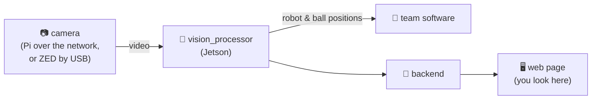

**🏠 Home** · 🚨 PANIC: [📷 Pi](pi/panic.md) · [🎥 ZED](zed/panic.md)

# Vision system docs: start here

## Which setup are you on?

There are two setups. They share the software, but start, stop and fix differently. **Pick yours first:**

| | 📷 **Pi camera** | 🎥 **ZED Box** |
|---|---|---|
| Camera | USB camera on a Raspberry Pi, video over the network | ZED 2i plugged into the Jetson by USB |
| Computer | Jetson AGX Orin `192.168.210.222` | ZED Box (Jetson Orin NX) `192.168.210.130` |
| Camera config | `config-pi-cam.yml` | `zed-config-lab.yml` |
| Field file | `geometry-event.yml` (foam mats) | `geometry-wrapper-lab-divB.yml` (lab field) |
| ▶️ Start / stop | [pi/start-stop.md](pi/start-stop.md) | [zed/start-stop.md](zed/start-stop.md) |
| 🚨 Something broke | [pi/panic.md](pi/panic.md) | [zed/panic.md](zed/panic.md) |
| 🛠️ One-time setup | [pi/setup.md](pi/setup.md) | [zed/setup.md](zed/setup.md) |
| 📷 Camera settings | [../pi_camera/README.md](../pi_camera/README.md) | [zed/camera.md](zed/camera.md) |
| 🧭 Decisions (why it is this way) | not written yet | [zed/decisions.md](zed/decisions.md) |
| 📊 Benchmarks (measured numbers) | not written yet | [zed/benchmarks.md](zed/benchmarks.md) |

**Not sure which?** Run `hostname` in the terminal. `GTW-ONX-…` is the ZED Box.

## What is this, in one picture?

1. **The camera** films the field.
2. **`vision_processor`** (the brain) finds robots and balls in every frame.
3. **The backend** (the post office) passes the results and pictures to the web page.
4. **The web page** shows you everything, and has buttons for calibration.

## Pages for both setups

| I want to… | Open |
|---|---|
| Understand how the parts fit together | [🧩 how-it-works.md](how-it-works.md) |
| Calibrate the field (4 corners) or measure the camera | [📐 calibration.md](calibration.md) |
| Fix wrong colours / sunlight problems | [🎨 colours.md](colours.md) |
| Dig into a specific error message | [🔍 troubleshooting.md](troubleshooting.md) |
| Know how fast it is / the GPU (CUDA) status | [⚡ performance.md](performance.md) |
| See what was changed | [📝 changelog.md](changelog.md) |
| A plain USB camera on a Jetson (TODO, untested) | [🔌 usb-camera.md](usb-camera.md) |
| Name a new file, or add a doc page (people and AI) | [📛 ../AGENTS.md](../AGENTS.md) |
