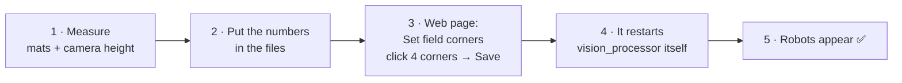

[🏠 Home](README.md) · 🚨 PANIC: [📷 Pi](pi-camera/panic.md) · [🎥 ZED](zed-box/panic.md)

# 📐 Calibration

**Both setups calibrate the same way.** Where file names differ, 📷 is the Pi camera setup and 🎥 the ZED Box.

**Why calibrate?** The camera sees pixels; the robots need positions in millimetres. Calibration teaches
`vision_processor` which pixel is which spot on the field. **Without it you get 0 robots.**

**You do not need a checkerboard, and right now you do not need white lines either.** You click 4 corners.

## Now: 4-corner calibration (no field lines)



1. **Measure** the mat area and the camera height ([how to measure](#measuring-the-field-and-the-camera)).
2. **Put the numbers in the files:**
   - Field size goes in the field file (`field_length`, `field_width`, `boundary_width`, `boundary_width_goal_line`): 📷 `geometry-event.yml` · 🎥 `geometry-wrapper-lab-divB.yml`. Then restart the backend.
   - Camera height goes in the camera config (`camera_height`): 📷 `config-pi-cam.yml` (now 1555 mm) · 🎥 `config-zed-lab.yml` (now 2000 mm, [needs checking](zed-box/camera.md#camera-height)).
3. **Click the corners:** on the web page press **Set field corners**, then click the **4 outer corners of the mats** on the camera picture.
   - **Corner 1** becomes the field's origin corner (−x, −y). Then go around the rectangle.
   - **Save** writes the corners, clears the old calibration and restarts `vision_processor` for you.
4. **Check:** the robot count goes above 0 and the drawn field outline sits on the mats. If it doesn't, click the corners again.

**Good to know:**
- **Mat edge versus field.** You click the mat edge. The backend works out the field inside it, 150 mm in from each edge.
- **Saving clears the old calibration.** The backend remembers the last calibration, and a restarted `vision_processor` would reuse it. Restarting by hand does **not** pick up new corners, so use the **Save** button.
- **The lens bending is not corrected yet.** The wide lens bends straight lines, so positions near the picture edges are a bit less accurate than in the middle. Field lines fix this later (below).
- **Clicking accuracy matters.** A few pixels off at a corner means a few centimetres off on the field.

## Measuring the field and the camera

📷 Pi camera event setup, foam mats (measured 2026-10-06). The 🎥 ZED Box's lab field is 4500 × 2230 mm in `geometry-wrapper-lab-divB.yml`.

```
┌──────────────── 3030 mm  (mat area = what you click) ────────────────┐
│  150 mm boundary  (boundary_width / boundary_width_goal_line)         │
│   ┌────────────── field 2730 × 1530 mm ──────────────┐                │
│   │                                                   │                │ 1830 mm
│   │   robot and ball positions are measured here      │                │
│   │   (field_length × field_width)                    │                │
│   └───────────────────────────────────────────────────┘                │
└───────────────────────────────────────────────────────────────────────┘
        mat size − 2 × boundary = field size
        3030 − 2·150 = 2730      1830 − 2·150 = 1530
```

**Field** (in the field file):
- **Measure the outer edge of the mats** on all 4 sides. If the two long sides differ, straighten the mats or use the average.
- **The long side** is `field_length`, the direction between the goals.
- **The boundary** is a margin inside the mats, here 150 mm.
- **Goal and penalty-area sizes** in the file are placeholders, scaled to fit. Replace them with the real goal sizes.

**Camera height** (`camera_height` in the camera config). 📷 Pi: **1555 mm** · 🎥 ZED Box: 2000 mm in the config, about 2.7 m measured by the ZED ([check it](zed-box/camera.md#camera-height))

```
        ┌─────────┐  camera box
        │  ┌───┐  │
        └──┤   ├──┘
           │   │  lens barrel
           └─┬─┘  ← front glass of the lens: measure from here
             │
             │   straight down (vertical), NOT along the tilted view
             │   = camera_height
             │
  ═══════════╧═════  top surface of the mats (not the floor underneath)
```

- **From the front glass of the lens.** Box middle versus lens tip only differs by 2–3 cm (under 2 %), so don't stress.
- **Straight down**, even though the camera is tilted. Use a plumb line (string and weight) or a laser meter. The calibration works out the tilt itself.
- **To the top of the mats.** Measured to the floor? Subtract the mat thickness.
- **Moved the camera?** Re-measure, and click the corners again.

## Later: field lines (when white tape is down)

When the outer rectangle (both sidelines and both goal lines) is visible as white lines or tape:
1. Set `refinement: true` under `geometry:` in the camera config.
2. Put the tape width in `line_thickness` in the geometry file.
3. Click the corners again. The lines now fine-tune the fit and correct the lens bending.
4. Check `error_rate` in `img/*.calib.json`: lower is better. Without lines this number means nothing (about 0.98).

## Always needed

- **Fixed camera settings and steady light.** 📷 Set them on the Pi ([camera settings](../pi_camera/README.md#5-adjusting-camera-settings)) · 🎥 in `config-zed-lab.yml` ([ZED camera settings](zed-box/camera.md)).
- **Robots with standard SSL markers, and an orange ball.** Colours are learned automatically ([🎨 colours.md](colours.md)).

Next: [🎨 colours.md](colours.md)
