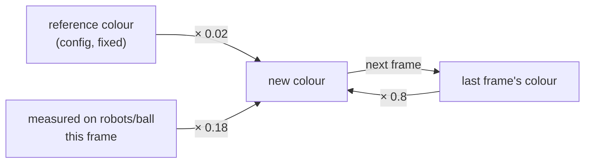

[🏠 Home](README.md) · 🚨 PANIC: [📷 Pi](pi-camera/panic.md) · [🎥 ZED](zed-box/panic.md)

# 🎨 Colours and sunlight

**Short version:** colours set themselves. You only step in if robots flip teams/IDs or the ball isn't found.

## How colours are learned

Every frame, each colour is nudged toward what the camera actually sees on the robots and ball:

- **How strongly colours stick to the reference** (`reference_force` / `history_force` in the `color:` section):
  - 📷 **Pi camera** (`config-pi-cam.yml`): a **weak pull** (`0.02` / `0.8`), so colours follow changing daylight within a few seconds. The picture above shows these numbers.
  - 🎥 **ZED Box** (`config-zed-lab.yml`): `0.1` / `0.7`, because the ZED's automatic exposure and white balance already move the colours. Don't set `reference_force: 0` there.
- **Brightness-free colours.** Colours are stored without brightness (dRGB), so a brighter or darker room changes them less.
- **No restart needed.** Changes to the `color:` section apply within half a second.

## The colour panel on the web page

| Button | Use it when |
|---|---|
| **Save learned colours as reference** | Detection works well right now, and you want this to be the starting point next time, for example after the light changed for good |
| **Pick** (per colour) | Backup: one colour is clearly wrong. Click that marker or the ball on the camera picture, then **Apply**. |

The swatches show the colour's hue only (brightness is removed), so they may look duller than the real markers.

## When colours go wrong

| You see | Try |
|---|---|
| Robots flip between blue and yellow team, or IDs change | Raise `reference_force` toward its limit (below) in your camera config. Check the dots aren't washed out to white. |
| Ball not found | Pick the orange from the image (panel → **Pick** → orange) |
| Markers look white on the camera picture | Too bright: lower exposure or gain. 📷 [on the Pi](../pi_camera/README.md#5-adjusting-camera-settings) · 🎥 [ZED settings](zed-box/camera.md) |
| Everything flickers when clouds pass | Use manual exposure, so the camera doesn't keep re-adjusting. 📷 on the Pi · 🎥 `exposure:` in `config-zed-lab.yml` |
| Panel says "not publishing" | `vision_processor` isn't running, or is an old build: `make -j6 -C build vision_processor`, then restart it |

The highest allowed `reference_force` is `0.5 − history_force / 2`: 0.1 on the 📷 Pi camera (history 0.8), 0.15 on the 🎥 ZED Box (history 0.7).

Back: [📐 calibration.md](calibration.md) · [🏠 Home](README.md)
