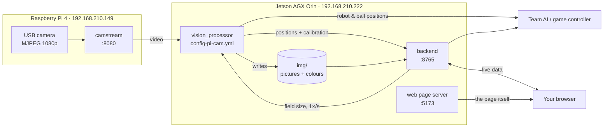
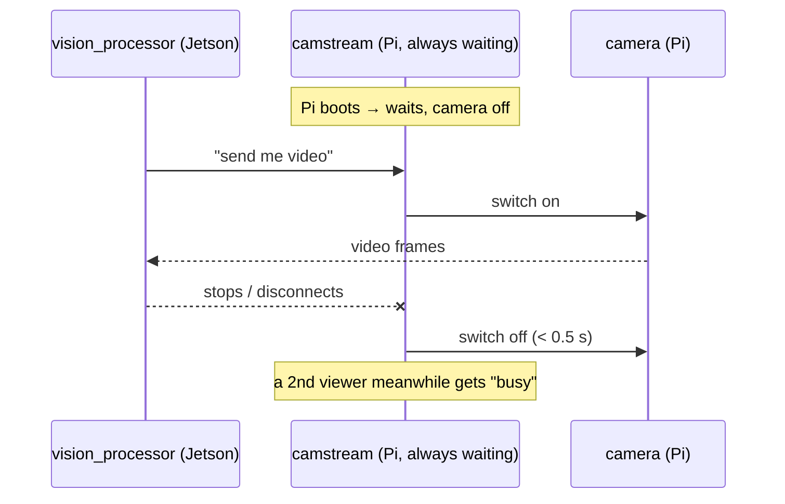

[🏠 Home](README.md) · [🚨 PANIC](panic.md) · [▶️ Start / Stop](start-stop.md)

# 🧩 How it works

## The short version

| Part | Think of it as | What it does | Runs on |
|---|---|---|---|
| **camstream** | 📷 the eyes | Sends the camera video over the cable. The camera is only on while someone watches. | Pi |
| **vision_processor** | 🧠 the brain | Finds robots and balls in every frame and works out where they are on the field | Jetson |
| **backend** (`wrapper_backend`) | 📮 the post office | Holds the field size, passes results and pictures to the web page, saves calibration changes. No image work. | Jetson |
| **web page** (`wrapper-frontend`) | 🖥️ the TV screen | Shows everything, and has buttons for calibration and colours | your browser |

## The full picture

## Frontend vs backend

- **Backend:** a small Python program on the Jetson (port 8765). It **knows things**: the field size, the latest robot positions, the camera pictures. It **changes things** when you click buttons: saving colours or corners, restarting `vision_processor`.
- **Frontend:** the web page in your browser. It **only shows** what the backend tells it, and sends your button clicks back. If the backend is down, the page says "disconnected".

## How the camera turns on and off

**Nobody presses a camera button.** Connecting turns it on, disconnecting turns it off:

Only **one** viewer at a time. That's why opening the stream in a browser while `vision_processor` runs gives "busy".

## Where things are written

| File | Written by | Used for |
|---|---|---|
| `config-pi-cam.yml` | you / the web page | camera address, camera height, field corners, colours |
| `geometry-event.yml` | you | field size (event foam mats) |
| `img/0.raw.jpg` | vision_processor (every second) | camera picture on the web page, corner clicking |
| `img/0.colors.json` | vision_processor (2×/s) | colour panel on the web page |
| `img/*.calib.json` | vision_processor (after calibration) | calibration result |

Next: [📐 calibration.md](calibration.md) · [🎨 colours.md](colours.md)
