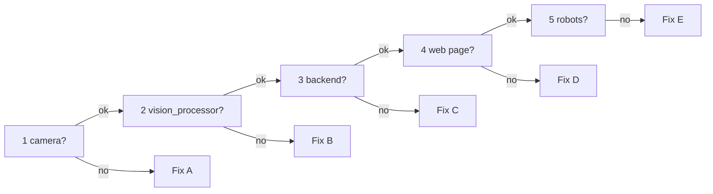

[🏠 Home](README.md) · **🚨 PANIC** · [▶️ Start / Stop](start-stop.md)

# 🚨 Something is broken

**Breathe.** Nothing here can break the hardware. Go top to bottom and stop at the first ❌.

## Step 1: find the broken part (1 minute)

Run each check on the Jetson, from the repo folder (`cd ~/ssl-software/test/ssl-vision-processor`):

| # | Check | ✅ Good looks like | ❌ If not → |
|---|---|---|---|
| 1 | `curl -m 2 http://192.168.210.149:8080/status` | `{"streaming": ...}` | [Fix A: camera](#fix-a-camera-pi) |
| 2 | `pgrep -a vision_processor` | a line with `config-pi-cam.yml` | [Fix B: vision_processor](#fix-b-vision_processor) |
| 3 | `curl -m 2 http://localhost:8765/api/health` | `{"status": "ok", ...}` | [Fix C: backend](#fix-c-backend) |
| 4 | open `http://192.168.210.222:5173` | the web page | [Fix D: web page](#fix-d-web-page) |
| 5 | web page shows robots | robot count > 0 | [Fix E: no robots](#fix-e-no-robots) |



## Step 2: fix it

### Fix A: camera (Pi)

| You see | Do this |
|---|---|
| `Connection refused` | The Pi is on but the service is stopped. On the Pi: `sudo systemctl restart camstream` |
| Nothing / timeout | The Pi is off or unplugged. Check its power and **Ethernet cable**, wait 1 minute after boot, then retry. |
| `"streaming": true` but you're not running anything | Something else is watching the camera (only one viewer allowed). Close `ffplay`, browser tabs on `:8080`, or a second `vision_processor`. |

More: [Pi troubleshooting](../pi_camera/README.md#troubleshooting)

### Fix B: vision_processor

- **Services panel on the web page:** press **Start** (or **Restart**), then open **Show log** and read the last lines.
- **No web page?** Start it by hand, which also turns the camera on:

```bash
build/vision_processor config-pi-cam.yml
```

- **Healthy output:** a `status: detecting | ... fps | N robots ...` line every 5 seconds.

| It prints | Do this |
|---|---|
| `Camera delivered no frame ... stopping` | Camera or network problem → [Fix A](#fix-a-camera-pi). With `--start-vision` it restarts by itself. |
| `status: waiting for field geometry` | Backend not running → [Fix C](#fix-c-backend) |
| `status: detecting ... 0 ... robots` | Not calibrated / robots outside the field → [Fix E](#fix-e-no-robots) |
| `Saved sample image` then stops | Not calibrated yet → [calibration.md](calibration.md) |
| `No OpenCL platform` | `sudo apt install pocl-opencl-icd` |
| `bad file: robot-heights.yml` | You're in the wrong folder. `cd ~/ssl-software/test/ssl-vision-processor` |
| `GStreamer warning ... /dev/video0` | Wrong config: use `config-pi-cam.yml`, not `config-usb-cam.yml` |

More: [troubleshooting → vision_processor](troubleshooting.md#vision_processor)

### Fix C: backend

```bash
PATH=$HOME/.local/bin:$PATH ./start_wrapper.sh geometry-event.yml --vision-config config-pi-cam.yml --start-vision
```

| It prints | Do this |
|---|---|
| `uv: command not found` | Use the line above exactly (it adds `uv` to the PATH) |
| `address already in use` | One is already running: `ss -ltnp \| grep 8765` shows its PID, stop it, start again |
| `KeyError: 'optional_field_lines'` | Wrong field file: use `geometry-event.yml` |

More: [troubleshooting → backend](troubleshooting.md#backend)

### Fix D: web page

```bash
cd wrapper-frontend && PATH=$HOME/.local/node/bin:$PATH npm run dev
```

| You see | Do this |
|---|---|
| Page doesn't load | Is the command above still running? Use the Jetson address `192.168.210.222`, not `localhost`, from another PC. |
| Page loads, says "disconnected" | The backend is down → [Fix C](#fix-c-backend) |
| Old or strange data | Reload the page (Ctrl+Shift+R) |

More: [troubleshooting → frontend](troubleshooting.md#frontend)

### Fix E: no robots

| You see | Do this |
|---|---|
| "not calibrated" | Click the 4 field corners → [calibration.md](calibration.md#now-4-corner-calibration-no-field-lines) |
| Calibrated, still 0 robots | Are the robots inside the field rectangle? Is the picture too bright (white dots) or too dark? → [colours.md](colours.md) |
| Robots flicker between teams / IDs | Colours drifted → [colours.md](colours.md) and click "Save learned colours" |

## Step 3: still broken? Restart everything, in order

1. **Stop everything:** press **Ctrl+C** in every terminal (web page, `vision_processor`, backend).
2. **Pi:** `sudo systemctl restart camstream`, on the Pi.
3. **Backend + `vision_processor`:** the command from [Fix C](#fix-c-backend). It starts `vision_processor` too.
4. **Web page:** the command from [Fix D](#fix-d-web-page). Reload the browser.

Still broken after that? Copy the **last 20 lines** of each terminal and ask for help.
