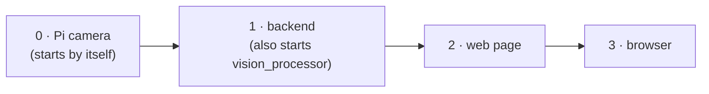

[🏠 Home](../README.md) · [🚨 PANIC](panic.md) · **▶️ Start / Stop** · 📷 Pi camera

# ▶️ Start and stop (Pi camera)

**This page is for the Pi camera setup:** the USB camera on a Raspberry Pi, streaming to the AGX Jetson. Using the ZED Box instead? → [ZED Box start / stop](../zed-box/start-stop.md)

Every command runs **on the Jetson**, from the repo folder, each in **its own terminal**:

```bash
cd ~/ssl-software/test/ssl-vision-processor
```

## Start (in this order)



| # | What | Command | Done when you see |
|---|---|---|---|
| 0 | Pi camera | nothing to do: it starts when the Pi boots. Check: `curl http://192.168.210.149:8080/status` (`.149` is the Pi's Ethernet, use this; `.150` is its Wi-Fi) | `{"streaming": false, ...}` |
| 1 | Backend **+ vision_processor** | `PATH=$HOME/.local/bin:$PATH ./start_wrapper.sh geometry-event.yml --vision-config config-pi-cam.yml --start-vision` | it keeps running; the Pi says `"streaming": true` |
| 2 | Web page | `cd wrapper-frontend && PATH=$HOME/.local/node/bin:$PATH npm run dev` | `Local: http://localhost:5173` |
| 3 | Browser | open `http://192.168.210.222:5173` (Tailscale: `http://100.84.89.60:5173`) | the page with the camera picture |

- **`--start-vision`.** The backend starts `vision_processor` for you, restarts it if it crashes, and gives you **Start / Stop / Restart** buttons and its log in the web page's **Services** panel.
  - Without the flag, start it by hand in its own terminal: `build/vision_processor config-pi-cam.yml`.
- **What it prints.** `vision_processor` prints a `status:` line every 5 seconds: what it's doing, fps, and how many robots and balls it sees.
- **Field file.** `geometry-event.yml` is the current foam-mat field. For the permanent lab field use `geometry-wrapper-lab-divB.yml`.
- **No dev server?** `cd wrapper-frontend && npm run build` once, then open `http://192.168.210.222:8765/` instead (steps 2–3 become one).

## Stop

| What | How |
|---|---|
| Everything | **Ctrl+C** in each terminal |
| Only the camera | **Stop** `vision_processor` in the Services panel (or Ctrl+C its terminal). The Pi switches the camera off within half a second. |
| The Pi service itself | On the Pi: `sudo systemctl stop camstream` (start again: `sudo systemctl start camstream`) |

## Restart one part

| Part | When | How |
|---|---|---|
| vision_processor | after changing camera height | **Restart** in the Services panel. The corner and lens tools restart it for you. |
| Backend | after changing the field file (`geometry-*.yml`) | Ctrl+C, then step 1 again |
| Web page | rarely, if it looks stuck | reload the browser (Ctrl+Shift+R) |
| Pi camera | camera not answering | on the Pi: `sudo systemctl restart camstream` |

**Colours and thresholds** in `config-pi-cam.yml` need **no restart**. They reload by themselves within half a second.

## After rebuilding the code

```bash
make -j12 -C build vision_processor
```

Then **Restart** `vision_processor` in the Services panel.

Something not working? → [🚨 panic.md](panic.md)
