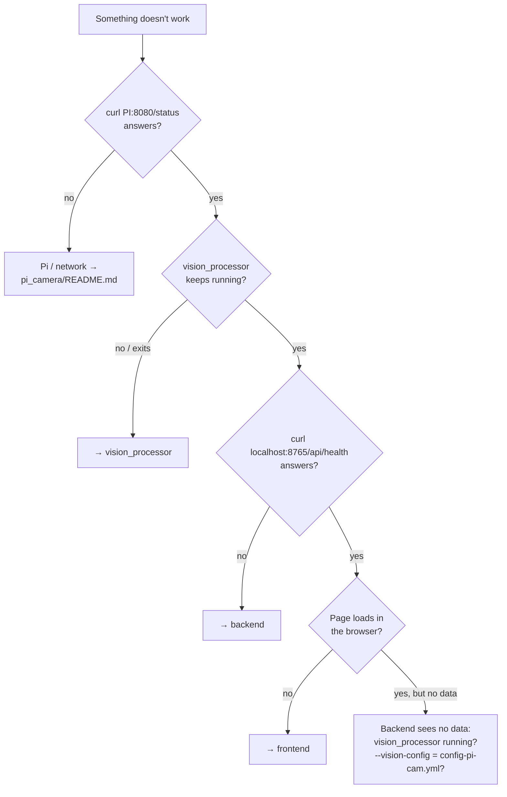
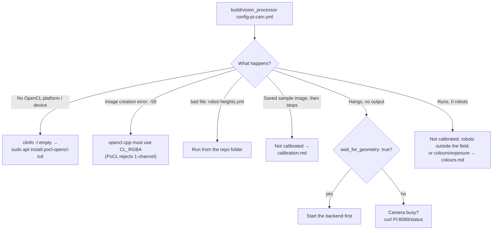
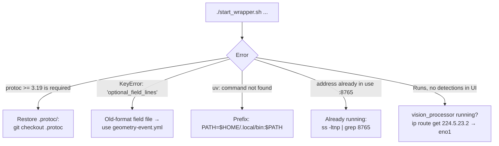
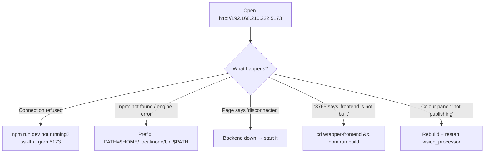

[🏠 Home](README.md) · [🚨 PANIC](panic.md) · [▶️ Start / Stop](start-stop.md)

# 🔍 Troubleshooting (detailed)

In a hurry? → [🚨 panic.md](panic.md) is shorter. This page is for when you have an error message to look up.

## Which part is broken?

Pi camera problems → [pi_camera/README.md troubleshooting](../pi_camera/README.md#troubleshooting)

## vision_processor

| Symptom | Fix |
|---|---|
| `frame time overrun: 40 ms` lines | The CPU is too slow for the camera fps. Use full-power mode ([performance.md](performance.md)) or lower the fps on the Pi. |
| Debug pictures (gradient/blob views) look striped | Known side effect of the CPU (PoCL) build. Detection is not affected. |
| `GStreamer warning ... no source element for URI "/dev/video0"` | Wrong config (USB). Use `config-pi-cam.yml`. |

## Backend

## Frontend

Back: [🏠 Home](README.md)
