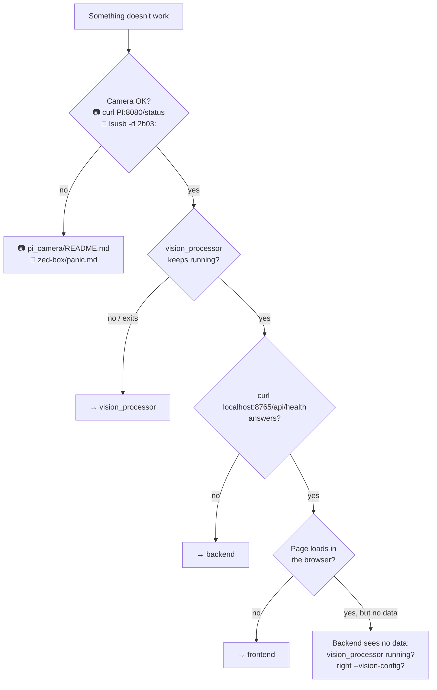
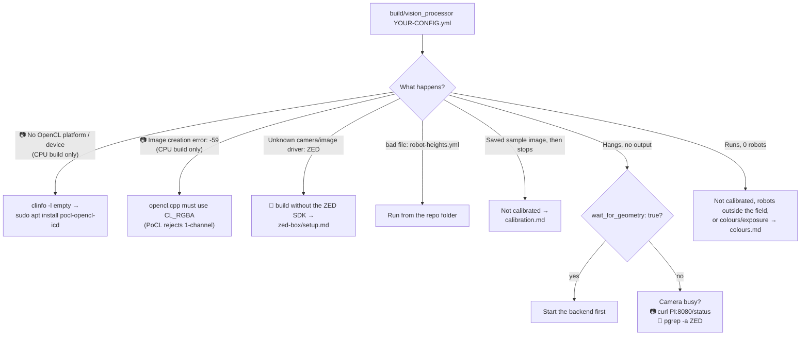
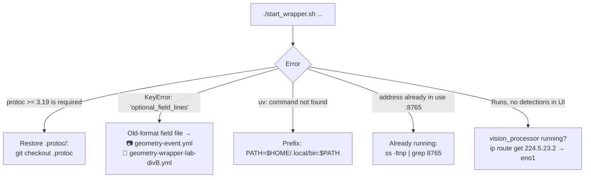
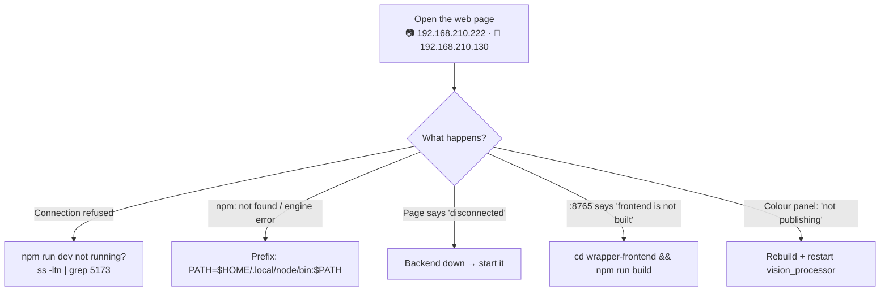

[🏠 Home](README.md) · 🚨 PANIC: [📷 Pi](pi-camera/panic.md) · [🎥 ZED](zed-box/panic.md)

# 🔍 Troubleshooting (detailed)

In a hurry? → the panic page for your setup is shorter: [📷 Pi camera](pi-camera/panic.md) · [🎥 ZED Box](zed-box/panic.md). This page is for when you have an error message to look up.

## Which part is broken?



Camera problems → 📷 [pi_camera/README.md troubleshooting](../pi_camera/README.md#troubleshooting) · 🎥 [ZED Box panic page, Fix A](zed-box/panic.md#fix-a-camera-zed)

## vision_processor



| Symptom | Fix |
|---|---|
| `frame time overrun: 40 ms` lines | Too slow for the camera fps. Use full-power mode ([performance.md](performance.md)) or lower the fps (📷 on the Pi · 🎥 `fps:` in `config-zed-lab.yml`). |
| Debug pictures (gradient/blob views) look striped | Known side effect of the CPU (PoCL) build only. Detection is not affected. |
| `GStreamer warning ... no source element for URI "/dev/video0"` | Wrong config: the USB draft config. Use 📷 `config-pi-cam.yml` or 🎥 `config-zed-lab.yml`. |

## Backend



## Frontend



### `npm run build` fails with `failed to resolve import "…"`

Example: `Rolldown failed to resolve import "dompurify"`.

- **Cause:** `package.json` lists a package that isn't in `node_modules` yet. This happens when the packages were installed before someone added a new one, usually after a pull or a branch switch. The code is fine.
- **Fix:** reinstall exactly what `package-lock.json` lists, then build:

```bash
cd wrapper-frontend && PATH=$HOME/.local/node/bin:$PATH npm ci && npm run build
```

### npm says `N vulnerabilities (… high)`

- **Not an error.** The build still worked. npm checks every installed package against a list of known security issues.
- **Most are build tools** (vite, postcss, …) that run only while building and never end up in the page. To check what actually ships in the page, run `npm audit --omit=dev`.
- **Optional fix:** `npm audit fix` updates them within safe versions. Rebuild afterwards, and commit `package-lock.json` if it still builds.
- **Don't run `npm audit fix --force`.** It jumps to new major versions and can break the build.

Back: [🏠 Home](README.md)
