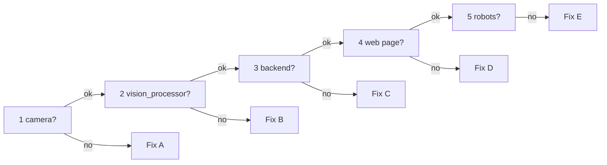

[🏠 Home](../README.md) · **🚨 PANIC** · [▶️ Start / Stop](start-stop.md) · 🎥 ZED Box

# 🚨 Something is broken (ZED Box)

**This page is for the ZED Box** (ZED 2i plugged into the Jetson). Pi camera setup? → [Pi camera panic page](../pi-camera/panic.md)

**Breathe.** Nothing here can break the hardware. Go top to bottom and stop at the first ❌.

## Step 1: find the broken part (1 minute)

Run each check on the ZED Box, from the repo folder (`cd ~/ssl-software/TIGERS/vision-processor`):

| # | Check | ✅ Good looks like | ❌ If not → |
|---|---|---|---|
| 1 | `lsusb -d 2b03:` | at least one line (StereoLabs USB id `2b03`) | [Fix A: camera](#fix-a-camera-zed) |
| 2 | `pgrep -a vision_processor` | a line with `config-zed-lab.yml` | [Fix B: vision_processor](#fix-b-vision_processor) |
| 3 | `curl -m 2 http://localhost:8765/api/health` | `{"status": "ok", ...}` | [Fix C: backend](#fix-c-backend) |
| 4 | open `http://192.168.210.130:8765` | the web page | [Fix D: web page](#fix-d-web-page) |
| 5 | web page shows robots | robot count > 0 | [Fix E: no robots](#fix-e-no-robots) |



## Step 2: fix it

### Fix A: camera (ZED)

| You see | Do this |
|---|---|
| `lsusb -d 2b03:` prints nothing | The ZED isn't connected. Check the USB cable at both ends, use a **USB 3** (blue) port, then retry. |
| Log: `[ZED] Waiting for camera: CAMERA NOT DETECTED` | Same: cable or port. `vision_processor` keeps waiting and opens the camera once it's back. |
| Log: `[ZED] Could not open camera: CAMERA STREAM FAILED TO START` | Another program has the ZED: a second `vision_processor`, `ZED_Explorer` or `ZED_Depth_Viewer`. Close it (`pgrep -a vision_processor`, `pgrep -a ZED`), then **Start** again. |
| Picture frozen or black on the web page | Unplug the ZED, wait 5 s, plug it back in, then **Restart** `vision_processor`. |

Still unsure whether the camera itself works? Stop `vision_processor` and run `/usr/local/zed/tools/ZED_Explorer`. If it shows a picture, the camera is fine.

### Fix B: vision_processor

- **Services panel on the web page:** press **Start** (or **Restart**), then open **Show log** and read the last lines.
- **No web page?** Start it by hand: `build/vision_processor config-zed-lab.yml`
- **Healthy output:** `Using device: CUDA … Orin`, then `[ZED] Opened ZED 2i …`, then a `status: detecting | … fps | N robots …` line every 5 seconds.

| It prints | Do this |
|---|---|
| `Unknown camera/image driver defined: ZED` | The build has no ZED support. Rebuild: [setup.md](setup.md#2-build-vision_processor) (the CMake log must say `ZED SDK found`). |
| `status: waiting for field geometry` | Backend not running → [Fix C](#fix-c-backend) |
| `status: detecting ... 0 ... robots` | Not calibrated / robots outside the field → [Fix E](#fix-e-no-robots) |
| `Saved sample image` then stops | Not calibrated yet → [calibration.md](../calibration.md) |
| `bad file: robot-heights.yml` | You're in the wrong folder. `cd ~/ssl-software/TIGERS/vision-processor` |
| fps well under 60 | See [camera.md](camera.md#frame-rate-and-resolution) |

More: [troubleshooting → vision_processor](../troubleshooting.md#vision_processor)

### Fix C: backend

```bash
PATH=$HOME/.local/bin:$PATH ./start_wrapper.sh geometry-wrapper-lab-divB.yml --vision-config config-zed-lab.yml --start-vision
```

| It prints | Do this |
|---|---|
| `uv: command not found` | Use the line above exactly (it adds `uv` to the PATH) |
| `address already in use` | One is already running: `ss -ltnp \| grep 8765` shows its PID, stop it, start again |
| `KeyError: 'optional_field_lines'` | Wrong field file: use `geometry-wrapper-lab-divB.yml` |

More: [troubleshooting → backend](../troubleshooting.md#backend)

### Fix D: web page

| You see | Do this |
|---|---|
| Page doesn't load | Is the backend running ([Fix C](#fix-c-backend))? From another PC use `192.168.210.130`, not `localhost`. |
| "frontend is not built" | `cd wrapper-frontend && PATH=$HOME/.local/node/bin:$PATH npm ci && npm run build`, then reload |
| Page loads, says "disconnected" | The backend is down → [Fix C](#fix-c-backend) |
| Old or strange data | Reload the page (Ctrl+Shift+R) |

More: [troubleshooting → frontend](../troubleshooting.md#frontend)

### Fix E: no robots

| You see | Do this |
|---|---|
| "not calibrated" | Click the 4 field corners → [calibration.md](../calibration.md) |
| Calibrated, still 0 robots | Are the robots inside the field rectangle? Is the picture too bright or too dark? → [camera.md](camera.md) and [colours.md](../colours.md) |
| Robots flicker between teams / IDs | Colours drifted → [colours.md](../colours.md) |

## Step 3: still broken? Restart everything, in order

1. **Stop everything:** **Ctrl+C** in the backend terminal (and any `vision_processor` started by hand).
2. **Camera:** unplug the ZED, wait 5 s, plug it back in.
3. **Backend + `vision_processor`:** the command from [Fix C](#fix-c-backend).
4. **Browser:** reload `http://192.168.210.130:8765`.

Still broken after that? Copy the **last 20 lines** of the backend terminal and the Services log, and ask for help.
