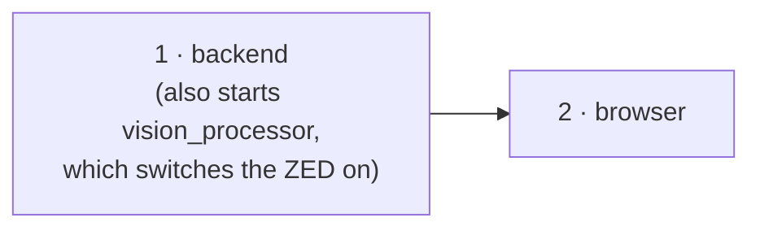

[🏠 Home](../README.md) · [🚨 PANIC](panic.md) · **▶️ Start / Stop** · 🎥 ZED Box

# ▶️ Start and stop (ZED Box)

**This page is for the ZED Box:** the StereoLabs Jetson (Orin NX) with the **ZED 2i plugged in by USB**. Using the Pi camera instead? → [Pi camera setup](../pi-camera/start-stop.md)

Every command runs **on the ZED Box**, from the repo folder:

```bash
cd ~/ssl-software/TIGERS/vision-processor
```

| ZED Box | Address |
|---|---|
| Ethernet | `192.168.210.130` |
| Tailscale | `100.89.101.109` |
| Web page | `http://192.168.210.130:8765` |

## Start



| # | What | Command | Done when you see |
|---|---|---|---|
| 1 | Backend **+ vision_processor** | `PATH=$HOME/.local/bin:$PATH ./start_wrapper.sh geometry-wrapper-lab-divB.yml --vision-config config-zed-lab.yml --start-vision` | it keeps running, and its log shows `[ZED] Opened ZED 2i …` |
| 2 | Browser | open `http://192.168.210.130:8765` (Tailscale: `http://100.89.101.109:8765`) | the page with the camera picture |

- **Nothing to start for the camera.** The ZED is on while `vision_processor` runs.
- **`--start-vision`.** The backend starts `vision_processor` for you, restarts it if it crashes, and gives you **Start / Stop / Restart** buttons and its log in the web page's **Services** panel.
  - Without the flag, start it by hand in its own terminal: `build/vision_processor config-zed-lab.yml`. Don't run both.
- **Healthy output.** A `status: detecting | 60 fps … | N robots …` line every 5 seconds.
- **Field file.** `geometry-wrapper-lab-divB.yml` is the lab field.
- **The page says "frontend is not built"?** `cd wrapper-frontend && PATH=$HOME/.local/node/bin:$PATH npm ci && npm run build`, then reload.

## Stop

| What | How |
|---|---|
| Everything | **Ctrl+C** in the backend terminal |
| Only `vision_processor` (and the camera) | **Stop** in the Services panel |

## Restart one part

| Part | When | How |
|---|---|---|
| vision_processor | after changing anything under `camera:` or `geometry:` in `config-zed-lab.yml` (fps, exposure, camera height, corners) | **Restart** in the Services panel |
| Backend | after changing the field file (`geometry-*.yml`) | Ctrl+C, then step 1 again |
| Web page | rarely, if it looks stuck | reload the browser (Ctrl+Shift+R) |

**No restart needed** for `color:`, `tracking:` and most of `thresholds:` and `debug:` in `config-zed-lab.yml`. They reload by themselves within half a second. The exceptions need a **Restart**: `thresholds: blobs`, `geometry_tolerance`, and `debug: wait_for_geometry`, `ground_truth`.

## Only one program can use the ZED

`vision_processor` holds the camera while it runs. ZED tools (`ZED_Explorer`, `ZED_Depth_Viewer`) or a second `vision_processor` will fail with `CAMERA STREAM FAILED TO START`. Stop `vision_processor` first.

## After rebuilding the code

```bash
make -j6 -C build vision_processor
```

Then **Restart** `vision_processor` in the Services panel.

Camera settings (fps, exposure, colours of the image): [🎥 camera.md](camera.md) · Something not working? → [🚨 panic.md](panic.md)
