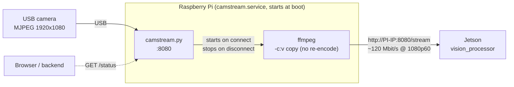
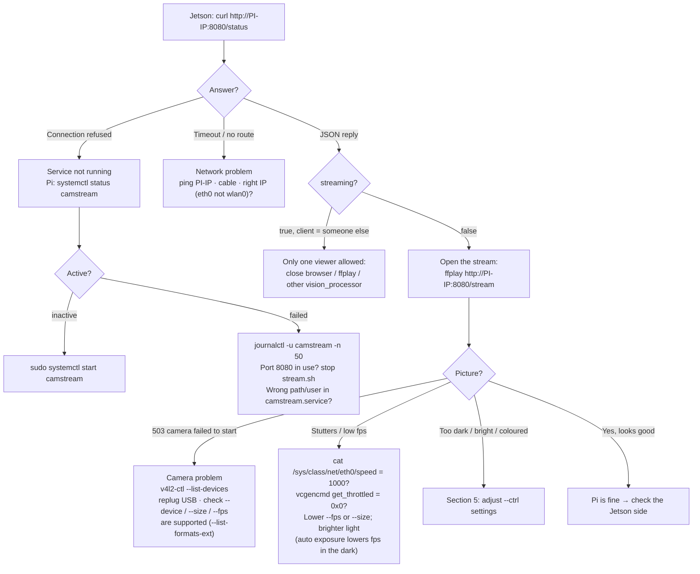

# Raspberry Pi network camera

Turns a Raspberry Pi with a USB camera into a network camera for `vision_processor`.
The Pi does **no image processing**: it passes the camera's own MJPEG frames through unchanged,
so even a small Pi can do it. All vision work happens on the Jetson.



| File | What it is |
|---|---|
| `camstream.py` | The stream server. Camera is **on only while someone watches** `/stream`. One viewer at a time. |
| `camstream.service` | systemd unit: starts `camstream.py` at boot and restarts it if it crashes. |
| `stream.sh` | Manual test loop (no service). One Ctrl+C stops it. |

## Which Pi?

A 1080p MJPEG frame is about 250 kB (2 Mbit), so the stream needs roughly **2 Mbit/s × fps** (≈120 Mbit/s at 60 fps, more for busy scenes).
The bottleneck is the network and USB bus, not the CPU.

| Model | Ethernet | Camera + network share USB 2? | Recommended max |
|---|---|---|---|
| **Pi 4 / Pi 5** (recommended) | Gigabit (native) | No (USB 3) | 1080p @ 120 fps |
| Pi 3B+ | "Gigabit" over USB 2 (~300 Mbit/s real) | Yes | 1080p @ 30–60 fps (test it) |
| Pi 3B | 100 Mbit/s over USB 2 | Yes | 720p @ 60 or 1080p @ 30 |

Also needed: a **wired Ethernet** connection (Wi-Fi is too slow/unstable for 60 fps),
a camera that offers **MJPG** (`v4l2-ctl --list-formats-ext`), and the official power supply
(undervoltage drops USB devices).

## 1. Prepare the Pi (once)

Flash **Raspberry Pi OS (64-bit) Bookworm** (Lite is enough) with SSH enabled. Then on the Pi:

```bash
sudo apt update && sudo apt install -y ffmpeg v4l-utils python3
```

Find the camera and check it supports MJPG:

```bash
v4l2-ctl --list-devices
```

```bash
v4l2-ctl -d /dev/video0 --list-formats-ext | grep -A3 MJPG
```

A USB camera usually shows up as two nodes (`/dev/video0` = video, `/dev/video1` = metadata). Use the first.
Note the Pi's **Ethernet** address with `ip -br addr show eth0`.

## 2. Install the service

From the Jetson (asks for the Pi password), copy the files:

```bash
scp pi_camera/camstream.py pi_camera/camstream.service pi_camera/stream.sh pi@<pi-ip>:~/
```

On the Pi, install and start it at boot:

```bash
sudo cp ~/camstream.service /etc/systemd/system/ && sudo systemctl daemon-reload && sudo systemctl enable --now camstream
```

> The unit assumes user `pi` and `/home/pi/camstream.py`. For another user, edit `User=` and the path in `camstream.service` first.

Check from the Jetson (should print `"streaming": false` = waiting, camera off):

```bash
curl http://<pi-ip>:8080/status
```

## 3. Start / stop

| What | Command (on the Pi) |
|---|---|
| Start now | `sudo systemctl start camstream` |
| Stop now | `sudo systemctl stop camstream` |
| Restart (after editing settings) | `sudo systemctl restart camstream` |
| Start at boot on / off | `sudo systemctl enable camstream` / `sudo systemctl disable camstream` |
| Is it running? | `systemctl status camstream` |
| Live log (camera ON/OFF, errors) | `journalctl -u camstream -f` |

The camera itself switches on/off automatically: `vision_processor` connecting turns it on, disconnecting turns it off.

**Manual test without the service** (stop the service first, both use port 8080):

```bash
sudo systemctl stop camstream && ~/stream.sh
```

Stop it with **one Ctrl+C**. The ffmpeg lines `Immediate exit requested` / `Bad file descriptor` are harmless.
Other settings: `SIZE=1280x720 FPS=30 ~/stream.sh`.

## 4. Viewing the camera

Only one viewer at a time, so stop `vision_processor` first. Then open `http://<pi-ip>:8080/stream`
in a browser, or on the Jetson:

```bash
ffplay -fflags nobuffer http://<pi-ip>:8080/stream
```

## 5. Adjusting camera settings

Resolution and frame rate are set with `--size` and `--fps`; image settings (exposure, gain, white balance...)
with repeatable `--ctrl name=value`, applied every time the camera switches on.

**Step 1 — see what your camera supports** (names differ between cameras):

```bash
v4l2-ctl -d /dev/video0 --list-ctrls-menus
```

**Step 2 — try values live** while `vision_processor` or a viewer is connected:

```bash
v4l2-ctl -d /dev/video0 --set-ctrl=auto_exposure=1 --set-ctrl=exposure_time_absolute=100
```

**Step 3 — make them permanent:** edit the `ExecStart=` line, then restart:

```bash
sudo systemctl edit --full camstream
```

```ini
ExecStart=/usr/bin/python3 /home/pi/camstream.py --device /dev/video0 --size 1920x1080 --fps 60 --port 8080 \
  --ctrl power_line_frequency=1 --ctrl auto_exposure=1 --ctrl exposure_time_absolute=100 \
  --ctrl white_balance_automatic=0 --ctrl white_balance_temperature=4600 --ctrl gain=0
```

```bash
sudo systemctl restart camstream
```

Good starting points for SSL vision (from [documentation.md](../documentation.md)):

| Setting | Typical control name | Advice |
|---|---|---|
| Light flicker | `power_line_frequency` | `1` = 50 Hz (Australia/Europe), `2` = 60 Hz. Removes banding/flicker. |
| Exposure | `auto_exposure` = `1` (manual), `exposure_time_absolute` (units of 0.1 ms) | Use manual. Must be shorter than one frame: < 166 at 60 fps, < 83 at 120 fps. Shorter = less motion blur, darker. |
| Brightness | `gain` | Raise only if too dark after exposure is maxed. Too bright → robot dots turn white → teams/IDs flicker. |
| White balance | `white_balance_automatic` = `0`, `white_balance_temperature` | Fixed value so colours don't drift; white field lines should look white, not orange. |
| Frame rate | `--fps` | 60 is the SSL norm. 120 needs a bright field and a fast enough Jetson pipeline. |

> Older kernels use `exposure_auto`, `exposure_absolute`, `white_balance_temperature_auto` instead.
> Colours of the robot markers do **not** need tuning on the Pi: `vision_processor` learns them automatically.

## Troubleshooting



| Symptom | Likely cause | Fix |
|---|---|---|
| `409 camera busy` | Another viewer is connected | Close it; check `client` in `/status` |
| `failed to set X` in the log | Control name/value not supported by this camera | Check `--list-ctrls-menus`, fix the `--ctrl` |
| Frame rate lower than set | Camera auto-exposure lengthens frames in dim light | Manual exposure below the frame time, more light |
| Pi reboots / camera disappears | Undervoltage | Official PSU; `vcgencmd get_throttled` should be `0x0` |
| Works on .150 but not .149 (or the reverse) | One address is Wi-Fi | Use the `eth0` address |
